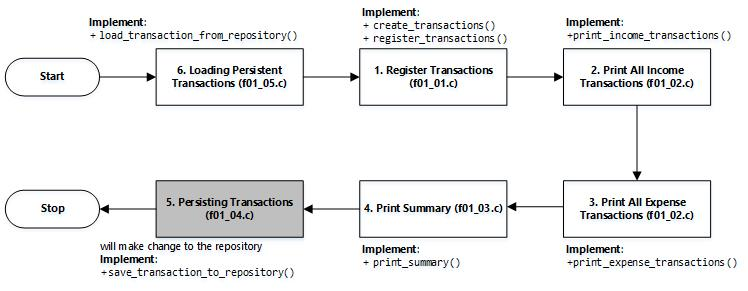

# Final Term Exam
Pada sesi ujian kali ini anda akan diminta untuk mengembangkan solusi atas suatu studi kasus yang memerlukan aplikasi dari berbagai konsep pemrograman yang telah anda pelajari. Sebagian dari fungsionalitas telah anda kembangkan pada beberapa tugas-tugas anda sebelumnya.

## Financial Management
Ucok dan Butet, sahabat selamanya, mengalami persoalan yang sama, mereka sulit dalam memanajemen keuangan. Sudah empat bulan terakhir Ucok dan Butet selalu mengalami defisit anggaran. Sebagai mahasiswa, Ucok dan Butet diberikan uang saku oleh orang tua mereka yang harus cukup untuk satu bulan. Istilah defisit adalah ketika jumlah uang pemasukan dalam sebulan tidak menutupi total pengeluaran, kondisi sebaliknya disebut surplus, sementara kondisi impas disebut balanced. Hal dasar pertama yang perlu dilakukan adalah mencatat seluruh transaksi yang terjadi dalam suatu periode tertentu, misal dalam satu bulan.

Sebuah transaksi (```transaction```) memiliki tiga buah atribut, yaitu nama transaksi (```title```), nilai transaksi (```amount```), dan tipe transaksi (```type```). Nama transaksi ditulis dalam bentuk teks dengan panjang tidak lebih dari 20 karakter. Nilai dari suatu transaksi bernilai bulat (whole number) dan bernilai positif. Terdapat dua tipe transaksi, yaitu ```income``` (pendapatan) dan ```expense``` (pengeluaran).

Ucok dan Butet kemudian merencanakan pengembangan suatu program interaktif yang akan membantu mereka dalam mencatat semua transaksi yang dilakukan. Interaksi antara pengguna dan program dicapai melalui instruksi-instruksi yang terstruktur. Sebuah instruksi ditulis dalam satu baris masukan melalui ```stdin```. Sebuah instruksi terdiri satu atau lebih segmen. Segmen pertama adalah perintah yang harus dikerjakan sementara segmen-segmen berikutnya adalah data yang disertakan untuk menyelesaikan instruksi. Setiap segmen dalam suatu instruksi diseparasi dengan sebuah hash sign (```#```).

Program yang dikembangkan harus mampu menampung transaksi dengan jumlah yang tidak terbatas (dinamis) dan hanya akan berhenti beroperasi jika diinstruksikan. Instruksi yang digunakan untuk menghentikan operasional program adalah ```---```. Berikut adalah daftar fungsionalitas program seserta struktur instruksi perintahnya.

### 1. Register Transactions (```f01_01.c```, 20pts)
Fungsionalitas ini bertujuan untuk menyimpan data transaksi, baik ```income``` maupun ```expense```. Instruksi untuk mencatat transaksi diawali dengan segmen perintah ```register-transaction``` yang diikuti oleh tiga buah segmen data ```transaction-type```, ```amount```, dan ```title```. Transaksi harus disimpan secara dinamis.
```
register-transaction#transaction-type#amount#title

```
Fungsionalitas ini tidak memberikan keluaran apapun.

Untuk menyelesaikan fungsionalitas ini, silakan melengkapi definisi fungsi ```register_transation```.

### 2. Print All Income Transactions (```f01_01.c```, 10pts)
Fungsionalitas ini bertujuan untuk menampilkan semua transaksi dengan tipe ```income``` ke ```stdout```. Instruksi yang diberikan untuk menjalankan fungsionalitas ini hanya terdiri atas satu segmen ```print-income-transactions```. Transaksi ditampilkan dari yang lebih awal dicatat hingga yang lebih akhir. Berikut adalah contoh instruksi yang digunakan.
```
print-income-transactions

```
Fungsionalitas akan menampilkan semua transaksi dengan tipe ```income```. Setiap transaksi ditulis dalam satu baris keluaran dengan menampilkan ```title```, ``amount``, dan ```transaction-type```. Pada keluaran, atribut ditulis dengan diseparasi oleh sebuah pipe (```|```). Berikut adalah contoh format keluaran yang diberikan.
```
title|amount|type

```
Untuk menyelesaikan fungsionalitas ini, silakan melengkapi definisi fungsi ```print_income_transations```.

### 3. Print All Expense Transactions (```f01_02.c```, 10pts)
Pada dasarnya, fungsionalitas ini serupa dengan fungsionalitas sebelumnya, perbedaannya terletak pada tipe transaksi yang ditampilkan yaitu ```expense```. Instruksi yang diberikan untuk menjalankan fungsionalitas ini hanya terdiri atas satu segmen ```print-expense-transactions```. Transaksi ditampilkan dari yang lebih awal dicatat hingga yang lebih akhir. Berikut adalah contoh instruksi yang digunakan.
```
print-expense-transactions

```
Format keluaran dari fungsionalitas ini sama dengan fungsionalitas sebelumnya.

Untuk menyelesaikan fungsionalitas ini, silakan melengkapi definisi fungsi ```print_expense_transations```.

### 4. Print Summary (```f01_03.c```, 20pts)
Fungsionalitas ini bertujuan untuk menampilkan saldo (```balance```) saat ini beserta kategori simpulan kondisinya, apakah surplus (```surplus```), defisit (```deficit```), atau impas (```balanced```). Instruksi yang diberikan untuk menjalankan fungsionalitas ini hanya terdiri atas satu segmen ```print-summary```. Nilai saldo di bawah ```0``` dikategorikan sebagai ```deficit```, nilai saldo di atas ```0``` dikategorikan ```surplus```, sementara nilai saldo tepat ```0``` dikategorikan ```balanced```.
```
print-summary

```
Keluaran ditulis dalam sebuah baris yang terdiri atas nilai saldo (```balance```) dan kategori simpulan kondisinya yang diseparasi dengan sebuah spasi (``` ```). Berikut adalah format keluaran.
```
balance summary
```
Untuk menyelesaikan fungsionalitas ini, silakan melengkapi definisi fungsi ```print_summary```.

### 5. Persisting Transactions (```f01_04.c```, 20pts)
Guna menjamin persistensi data, program diharapkan untuk mampu menyimpan transaksi pada persistent storage dalam bentuk plain-text file. Berkas yang digunakan untuk menyimpan transaction adalah ```./storage/transaction-repository.txt```. Penyimpanan transaksi dilakukan secara otomatis sesaat sebelum program berhenti beroperasi. Transaksi disimpan secara kronologis sesuai dengan urutan pencatatan. Sebuah transaksi disimpan dalam sebaris teks dengan mencantumkan transaction-type, amount, dan title. Setiap atribut transaksi diseparasi dengan sebuah pipe symbol (```|```). Berikut adalah format representasi sebuah transaksi dalam persistent storage.
```
title|amount|type

```
Fungsionalitas ini tidak memberikan keluaran apapun ke ```stdout```.

Untuk menyelesaikan fungsionalitas ini, silakan melengkapi definisi fungsi ```save_transactions_to_repository```.

### 6. Loading Persistent Transactions (```f01_05.c```, 20pts)
Fungsionalitas ini pada dasarnya adalah upaya untuk memanfaatkan persistent data yang dihasilkan pada sesi penggunaan sebelumnya. Semua persistent transaction yang tersimpan pada persistent storage dibaca sehingga tersedia bagi program. Format dari sebuah persistent transaction dapat dilihat pada penjabaran fungsionalitas sebelumnya. Fungsionalitas ini dilakukan secara otomatis dan dilakukan sesaat sebelum program menerima instruksi-instruksi dari pengguna.

Fungsionalitas ini tidak memberikan keluaran apapun ke ```stdout```.

Untuk menyelesaikan fungsionalitas ini, silakan melengkapi definisi fungsi ```load_transactions_from_repository```.

### Problems Schematics


### Implementation requirements
1. Definisi transaksi telah disediakan dalam bentuk structure pada berkas ```transaction.h```, demikian juga dengan tipe transaksi (```type_t```), dan berbagai function prototypes yang diperlukan terkait manipulasi transaksi. Anda tidak diizinkan untuk memodifikasi header file tersebut. Meski demikian, anda diizinkan untuk melengkapi ```transaction.c```.
2. Definisi berbagai function prototypes yang diperlukan terkait interaksi dengan berkas telah disajikan pada ```repository.h```. Anda tidak diizinkan untuk memodifikasi header file tersebut. Meski demikian, anda diizinkan untuk melengkapi ```repository.c```.
3. Anda diizinkan untuk mendefinisikan structure, enumeration, atau functions lainnya yang dapat membantu anda dalam menyelesaikan persoalan pada ```custom.h``` dan ```custom.c```.

## Examples
### Example 1
```
register-transaction#income#1000#uang saku
register-transaction#income#200#hibah dari opung
print-income-transactions
register-transaction#income#300#hibah dari uda
print-income-transactions
---

```
Output
```
uang saku;1000;income
hibah dari opung;200;income
uang saku;1000;income
hibah dari opung;200;income
hibah dari uda;300;income

```

### Example 2
```
register-transaction#income#1000#uang saku
register-transaction#expense#100#beli pulsa
register-transaction#expense#100#ganti jok sepeda
print-expense-transactions
print-summary
register-transaction#income#200#hibah dari opung
register-transaction#expense#49#sputivi
print-income-transactions
register-transaction#income#300#hibah dari uda
register-transaction#expense#200#beli sepatu
register-transaction#expense#100#ganti RAM
print-summary
print-income-transactions
print-expense-transactions
---

```
Output
```
beli pulsa;100;expense
ganti jok sepeda;100;expense
800 surplus
uang saku;1000;income
hibah dari opung;200;income
951 surplus
uang saku;1000;income
hibah dari opung;200;income
hibah dari uda;300;income
beli pulsa;100;expense
ganti jok sepeda;100;expense
sputivi;49;expense
beli sepatu;200;expense
ganti RAM;100;expense

```

## Video Description
See the problem description https://youtu.be/QCCiYk_dQpk

## Submission
1. f01_01.c
2. f01_02.c
3. f01_03.c
4. f01_04.c
5. f01_05.c
6. transaction.c
7. repository.c
8. custom.h
9. custom.c
10. changelog.txt

## How to submit?
Please see https://youtu.be/g0BQ195-aWo