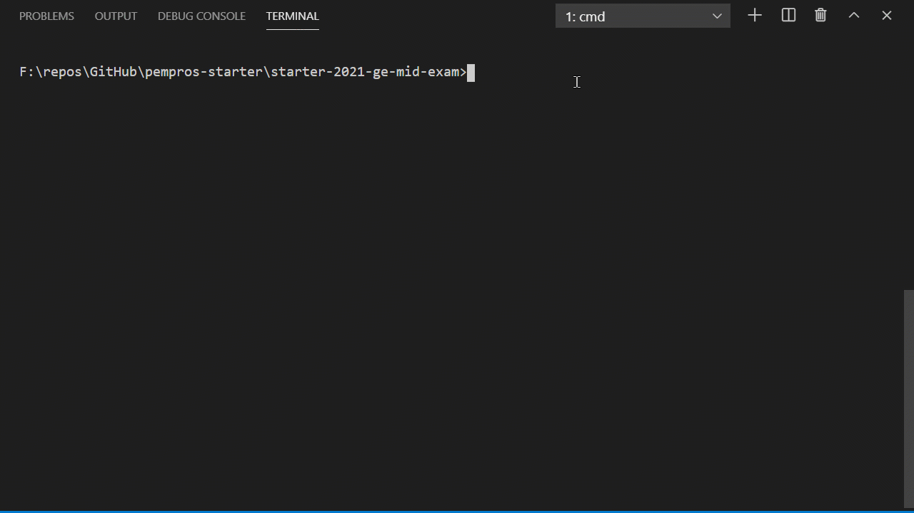

# Mid Exam
Pada ujian tengah semester ini anda akan diminta untuk mengaplikasikan berbagai pengetahuan yang sudah anda peroleh di sepanjang paruh semester ini. Semua materi akan tercakup oleh sebab itu, kerja sama yang baik antaranggota pair sangat penting demi mencapai hasil maksimal.

## Grading Components
Ucok dan Butet adalah mahasiswa yang baik, mereka tergabung dalam satu pair ketika mengerjakan tugas pemrograman. Di setiap akhir semester, untuk setiap mata kuliah, Ucok dan Butet akan mendapat ```nilai akhir``` yang selanjutnya akan dikonversi menjadi nilai huruf, misal ```A```, ```AB```, ```B```, ```BC```, dst.

Nilai akhir untuk setiap mata kuliah diperoleh dari kontribusi berbagai komponen penilaian. Setiap komponen penilaian diberi bobot dalam bentuk presentase. Total presentase adalah 100%. Komponen penilaian pada setiap mata kuliah bisa saja berbeda dengan mata kuliah yang lain, demikian pula dengan persentasenya. Meski demikian, sebuah mata kuliah memiliki paling sedikit satu komponen penilaian. Sebagai contoh ada mata kuliah dengan empat komponen penilaian, yang terdiri dari ```quiz```, ```assignment```, ```mid exam```, dan ```final exam``` dengan bobot masing-masing 20%, 30%, 25% dan 25%. Sementara itu ada juga mata kuliah yang hanya memiliki dua komponen penilaian, yang terdiri dari ```seminar proposal```, dan ```seminar kemajuan``` dengan bobot masing-masing 40% dan 60%.

Ucok dan Butet ingin mengembangkan sebuah program sederhana yang akan digunakan untuk menghitung nilai akhir dari mata kuliah yang mereka ikuti dengan memperhatikan komponen-komponen penilaian dan bobot dari komponen-komponen tersebut.

Berikut adalah rancangan dari program yang akan dikembangkan:
1. Pada saat dieksekusi, program akan membaca satu argumen tambahan yang menunjukkan jumlah komponen (```k```) yang akan diperhitungkan, di mana ```0 < k <= 5```.
2. Selanjutnya program akan membaca ```k``` buah baris komponen penilaian. Setiap baris komponen penilaian mencantumkan informasi ```nama``` komponen, persentase ```bobot``` komponen, dan ```nilai``` yang diperoleh. Informasi diseparasi dengan sebuah ```#```. Panjang sebaris teks komponen penilaian tidak lebih dari 100 karakter. Selain itu, dijamin persentase ```bobot``` komponen dan ```nilai``` yang diperoleh adalah bilangan bulat (```0 <= nilai <= 100```).
3. Komponen penilaian dikemas dalam structure.
4. Setelah semua baris komponen dimasukkan, program kemudian akan menampilkan setiap komponen penilaian dalam satu baris keluaran, berurut dari yang lebih dahulu dimasukkan. Setiap baris keluaran menampilkan ```nama``` komponen, persentase ```bobot``` komponen, dan ```nilai``` yang diperoleh dengan tanda semicolon (```;```) sebagai separator.
5. Selanjutnya, program akan menghitung nilai akhir sesuai dengan komponen-komponen penilaian yang sudah diberikan untuk selanjutnya menampilkannya dalam satu baris keluaran dengan satu angka presisi.
6. Terakhir, program akan memberikan kesimpulan apakah ```nilai akhir``` tersebut dapat dikategorikan lulus atau belum. Jika lulus maka program akan memberi keluaran ```passed```, sebaliknya ```failed```. Batas minimum ```nilai akhir``` untuk dapat dikategorikan lulus adalah 50.0.

### Example 1
Input dengan ```2``` sebagai additional argument pada saat eksekusi.
```
project#60#81
final exam#40#78

```
Output
```
project;60;81
final exam;40;78
79.8
passed

```
### Example 2
Input dengan ```4``` sebagai additional argument pada saat eksekusi.
```
quiz#20#47
assignment#30#93
mid exam#25#78
final exam#25#81

```
Output
```
quiz;20;47
assignment;30;93
mid exam;25;78
final exam;25;81
77.1
passed

```
### Example 3
Input dengan ```5``` sebagai additional argument pada saat eksekusi.
```
quiz#10#47
assignment#20#63
project#20#55
mid exam#20#40
final exam#30#44

```
Output
```
quiz;10;47
assignment;20;63
project;20;55
mid exam;20;40
final exam;30;44
49.5
failed

```



## Submission
1. m01_01.c
2. changelog.txt

## How to submit?
Please see https://youtu.be/g0BQ195-aWo