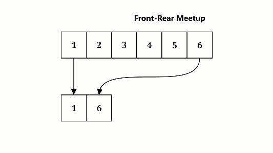

## Array

Pada sesi ini anda diminta untuk menyelesaikan dua buah persoalan yang akan melatih imajinasi serta kemampuan anda dalam memanipulasi array satu dimensi.

### Task 01: Dump The Numbers (score: 40pts; file : t02_01.c)
Tuliskan sebuah program yang akan membaca sebuah bilangan bulat positif, ``n|n > 0``, dari ```stdin```. Selanjutnya, program akan membaca bilangan bulat positif sebanyak ```n``` kali dan menyimpannya kedalam array dengan ukuran ```n```. Kemudian, program akan menampilkan semua nilai pada array mulai dari nilai yang pertama kali di-masukkan hingga yang terakhir dalam sebaris keluaran ke ```stdout```. Setiap nilai yang ditampilkan dipisahkan dengan tanda koma (```,```).

#### Example 1
Input
```
6
1
2
3
4
5
6

```
Output
```
1,2,3,4,5,6

```
#### Example 2
Input
```
7
14
10
46
32
68
42
0

```
Output
```
14,10,46,32,68,42,0

```

### Task 02: Front-Rear Meetup (score: 60pts; file : t02_02.c)
Butet melihat hasil pekerjaan Ucok pada t02_01. Menurut Butet, tugas tersebut tidak cukup menantang. Tidak membuat adrenalin berdesir naik-turun. Butet kemudian memberi tantangan dengan mengembangkan t02_01, Ucok pun menyanggupi tantangan tersebut.

Butet ingin, selain menampilkan keluaran seperti pada deskripsi Task 01, agar program menampilkan nilai-nilai dari array secara bergantian front-rear dan bergerak ke tengah-tengah array. Perhatikan ilustrasi berikut dengan seksama, misal untuk Example 1, program harus menampilkan:
```
1,2,3,4,5,6
1,6,2,5,3,4

```
Program akan menampilkan nilai pada index terendah (front-index) lalu menampilkan nilai pada index tertinggi (rear-index). Selanjutnya, front-index bergeser ke index yang lebih tinggi. Sebaliknya, rear-index bergeser ke index yang lebih rendah.



#### Example 1
Input
```
6
1
2
3
4
5
6

```
Output
```
1,2,3,4,5,6
1,6,2,5,3,4

```
#### Example 2
Input
```
7
14
10
46
32
68
42
0

```
Output
```
14,10,46,32,68,42,0
14,0,10,42,46,68,32

```

## Submission
1. t02_01.c
2. t02_02.c
3. changelog.txt

## How to submit?
Please see https://youtu.be/g0BQ195-aWo