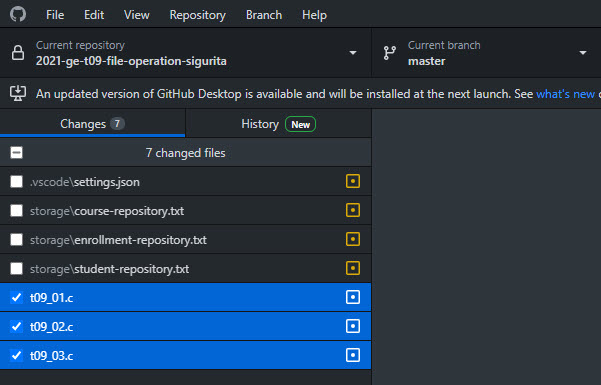

## Academic Simulator: Data Persistence
Tugas kali ini adalah kelanjutan dari tugas terstruktur sebelumnya dengan tujuan penambahan fitur Academic Simuator dengan data persistence.

### Persistent Data
Academic Simulator hasil karya Ucok dan Butet sudah memasuki tahap Alpha release. Simulator sedang dalam masa uji coba oleh berbagai stakeholder, seperti Mahasiswa, Dosen, dan Bagian Administrasi Akademik -- BAA. Dalam masa uji coba, BAA menemukan bahwa data yang pernah di-entry menghilang dari simulator. Dari laporan BAA disebutkan bahwa simulator tidak mengalami crash atau dihentikan prosesnya secara paksa atau hal lain yang tidak sewajarnya.

Setelah melakukan investigasi, Butet kemudian menyimpulkan bahwa simulator bekerja dengan baik namun karena semua data disimpan secara transient di phisical memory pada saat runtime maka mematikan atau menghentikan simulator akan turut menghapus data tersebut. Masih merujuk pada laporan BAA bahwa diperlukan kemampuan simulator untuk mempertahankan data yang telah dimasukkan selama simulator gracefully halted. Pada situasi operasional nantinya, agar data yang dimanajemen oleh simulator dapat dipergunakan untuk keperluan lainnya, maka data tersebut harus dapat diakses dengan mudah.

Dari persoalan yang ada, Ucok dan Butet berpikir untuk mengembangkan suatu mekanisme guna menyimpan data dari simulator ke suatu media penyimpanan yang persistent dan portable. Ucok berpendapat bahwa mekanisme data loading dan data saving hanya dilakukan di awal dan di akhir secara indenpenden dan diberlakukan untuk setiap jenis entitas (```student```, ```course```, dan ```enrollment```). Dari analisis yang sudah dilakukan, Butet selanjutnya menjabarkan beberapa fitur tambahan yang perlu dikembangkan untuk mengakomodir kebutuhan data persistence sebagai berikut:
1. Pada proses start up, sebelum adanya interaksi dengan pengguna, simulator harus terlebih dahulu me-load existing data untuk ketiga entitas (```student```, ```course```, dan ```enrollment```). Data loading dilakukan secara otomatis tanpa perlu instruksi dengan pengguna. Existing data disimpan pada local directory yang accessible.
2. Pada proses shut down, setelah tidak dimungkinkan adanya interaksi dengan pengguna, simulator harus men-save transient data sehingga persistent. Data saving dilakukan secara otomatis tanpa perlu instruksi dengan pengguna. Data disimpan pada local directory yang accessible.
3. Untuk menyederhanakan arsitektur simulator, data disimpan pada direktori ```./storage```. Untuk entitas ```student``` disimpan pada berkas ```./storage/student-repository.txt```, untuk entitas ```course``` disimpan pada berkas ```./storage/course-repository.txt```, dan entitas ```enrollment``` pada berkas ```./storage/enrollment-repository.txt```. By default, ketiga berkas akan dalam status ```exist```.
4. Implementasi untuk entitas ```student``` dikerjakan pada ```t09_01.c```, untuk entitas ```course``` pada ```t09_02.c```. dan entitas ```enrollment``` pada ```t09_03.c```.

#### 1. Loading and saving the students (file: ```t09_01.c```)
Pada tugas ini anda akan dibimbing untuk mengembangkan mekanisme data loading dan saving untuk entitas ```student```. Perlu diingat bahwa pada saat melakukan loading dan saving harus dipastikan bahwa setiap objek adalah unik menurut ```id```-nya. Sebuah entitas disimpan dalam satu baris pada stream. Atribut-atribut ditulis dengan separator pipe (```|```) dan diakhiri dengan sebuah line-feed (```\n```). Perhatikan format struktur penyimpanan berikut.
```
<id>|<name>|<year>|<study-program>|<gpa>

```
Silakan untuk melihat video demonstrasi.

#### 2. Loading and saving the courses (file: ```t09_02.c```)
Pada dasarnya, fitur ini sama dengan fitur sebelumnya. Perbedaan utamanya terletak pada entitas yang ditangani yaitu ```course``` dan atribut yang ditampilkan. Nilai dari atribut ```code``` digunakan untuk menjamin keunikan antarentitas. Perhatikan format struktur penyimpanan berikut.
```
<code>|<name>|<credit>|<passing-grade>

```

#### 3. Loading and saving the enrollments (file: ```t09_03.c```)
Fitur ini mirip dengan kedua fitur sebelumnya namun dengan tingkat kompleksitas yang lebih tinggi. Untuk fitur ini, entitas yang dimanipulasi adalah ```enrollment``` dan kombinasi atribut yang digunakan untuk menjamin keunikan adalah ```course-code```, ```student-id```, ```year```, ```semester```, dan ```grade```. Anda juga harus menjamin bahwa setiap 111 yang di-load adalah valid, artinya merupakan ```enrollment``` yang menggunakan existing ```student``` dan ```course```. Perhatikan struktur penyimpanan berikut.
```
<course-code>|<student-id>|<year>|<semester>|<grade>

```
### Initial Data
Telah diberikan default data untuk ketiga entitas, silakan untuk memeriksa ketiga berkas penyimpanan tersebut.

### Case studies
#### Case 1 (t09_01.c, 0 points)
Case ini ditujukan untuk memeriksa data loading untuk entitas ```student```. Setelah data di-load kemudian mendapatkan instruksi dari pengguna untuk menampilkannya. Berikut adalah contoh masukan yang diberikan.
```
print-students
---

```
Berikut adalah keluaran yang diharapkan.
```
12S20999|Wiro Sableng|2020|Information Systems|3.75
12S20998|Jaka Sembung|2020|Information Systems|3.50

```
#### Case 2 (t09_01.c, 20 points)
Case ini adalah extension dari Case 1 dengan menambahkan beberapa instruksi untuk menambahkan ```student```s baru dan menguji keberhasilan data saving. Pasca shut down, ```./storage/student-repository.txt``` akan diisi dengan kumpulan data yang baru. Berikut adalah contoh masukan yang diberikan.
```
print-students
create-student#12S19888#Milkyman#2019#Informatika
create-student#12S19887#Petrik Starfish#2019#Informatika
print-students
---

```
Berikut adalah keluaran yang diharapkan.
```
12S20999|Wiro Sableng|2020|Information Systems|3.75
12S20998|Jaka Sembung|2020|Information Systems|3.50
12S20999|Wiro Sableng|2020|Information Systems|3.75
12S20998|Jaka Sembung|2020|Information Systems|3.50
12S19888|Milkyman|2019|Informatika|0.00
12S19887|Petrik Starfish|2019|Informatika|0.00

```
#### Case 3 (t09_02.c, 20 points)
Case ini digunakan untuk menguji data loading pada entitas ```course```. Untuk dapat lulus dari pengujian ini, anda harus terlebih dahulu lulus pada pengujian sebelumnya (Case 1 dan 2). Berikut adalah contoh masukan yang diberikan.
```
print-students
print-courses
create-student#12S19888#Milkyman#2019#Informatika
create-student#12S19887#Petrik Starfish#2019#Informatika
print-students
create-course#10S1002#Procedural Programming#2#C
print-courses
---

```
Berikut adalah keluaran yang diharapkan.
```
12S20999|Wiro Sableng|2020|Information Systems|3.75
12S20998|Jaka Sembung|2020|Information Systems|3.50
12S1102|Visual Programming|2|D
TIS1101|Digital Innovation|2|D
12S20999|Wiro Sableng|2020|Information Systems|3.75
12S20998|Jaka Sembung|2020|Information Systems|3.50
12S19888|Milkyman|2019|Informatika|0.00
12S19887|Petrik Starfish|2019|Informatika|0.00
12S1102|Visual Programming|2|D
TIS1101|Digital Innovation|2|D
10S1002|Procedural Programming|2|C

```

## Implementation constraints
1. Anda tidak diizinkan untuk memodifikasi berkas ```academic.h``` dan ```repository.h```.
2. Mohon untuk tidak men-submit berkas pada direktori ```./storage``` ke GHC.
3. Demo: https://youtu.be/eeuqXi2HEjA


## Submission
1. academic.c
2. t09_01.c
3. t09_02.c
4. t09_03.c
5. changelog.txt

## How to submit?
Please see https://youtu.be/g0BQ195-aWo